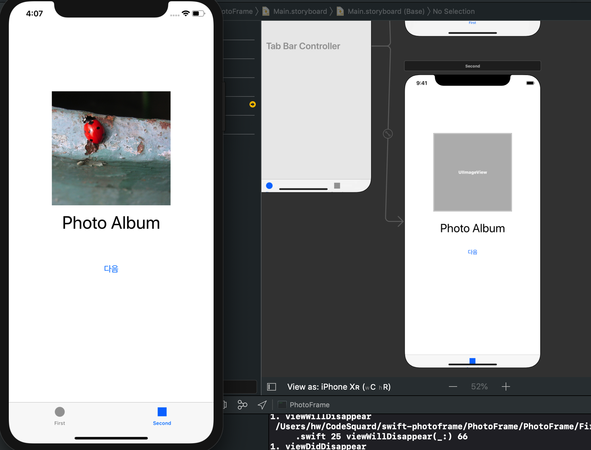
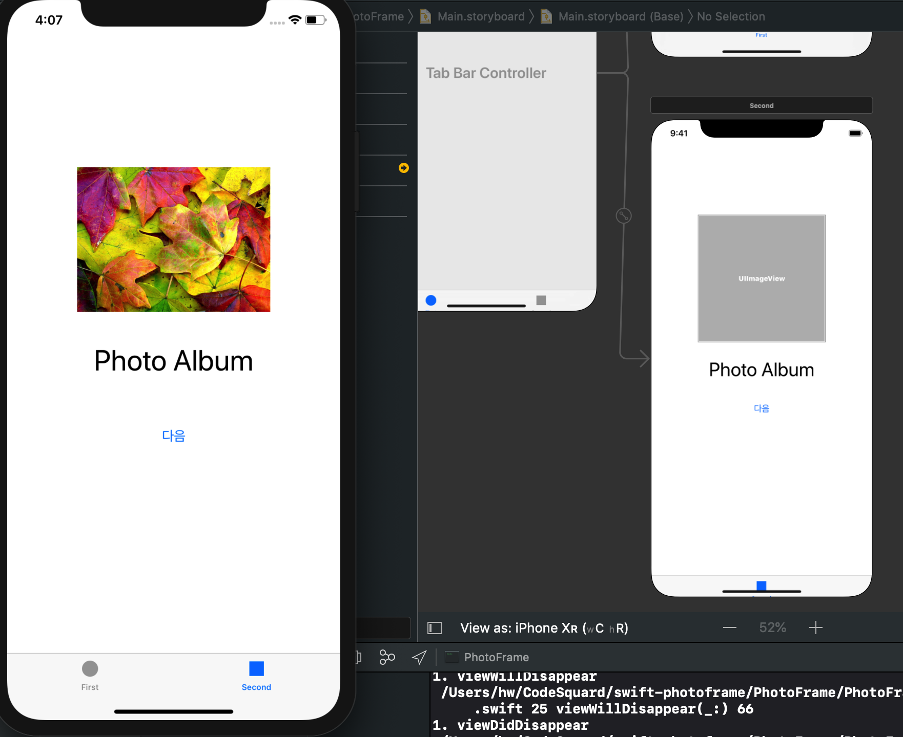

**STEP 11-7**

# 0. 결과화면

### Q. Assets.xcassets에 디렉토리 접근하듯 접근하는게 가능할까?

- STEP 진행 과정에서 Assets에 레퍼런스 추가한 image 파일들을 Array의 형태로 한번에 로드하려고 하였으나, UIImage의 파라미터 레이블인 `named` 에 그룹명 (DemoImage) 을 입력하여 배열 형태로 받는 것은 실패. Document 정의에도 알 수 있듯, 복수의 이미지를 받아오는 것을 지원하지는 않는다.
- 복수의 image data set을 받는 UIImage 관련 메서드가 있는지 탐색해보았으나 실패


### A. FileManager or Bundle

> 결론부터 말해서 Assets catalog는 **아카이브**로 폴더와 다르다. 따라서 일반 디렉토리처럼 접근하기에는 다소 무리가 있다.
>
> 이미지 파일 번들을 프로젝트 경로에 추가하여 해당 번들에 이미지들을 drag로 넣어준 다음,  FileManager를 사용하여 해당 디렉토리 경로에서 파일들을 읽어오는 방식으로 대처하면 된다.


[Load array of images using group in xcassets ](https://stackoverflow.com/questions/48720250/load-array-of-images-using-group-in-xcassets)


코드 출처 : https://www.hackingwithswift.com/read/1/2/listing-images-with-filemanager

```swift
let fm = FileManager.default
let path = Bundle.main.resourcePath!
let items = try! fm.contentsOfDirectory(atPath: path)

for item in items {	/// items는 filenames string
    if item.hasPrefix("nssl") {
        // this is a picture to load!
    }
}
```

- FileManager를 사용하려면 Assets 내부가 아니라 프로젝트 파일의 외부나 app의 bundle에 이미지 파일 디렉토리가 존재해야 한다.
  - `bundle` is a directory containing our compiled program and all our assets.

- app bundle에 이미지 디렉토리를 추가(reference 추가 포함)한 경우, `Bundle.main.resourcePath!` 로 앱 프로젝트의 내부 리소스 경로로 경로를를 설정할 수 있다.
- `fm.contentsOfDirectory(atPath: pathString)`메서드는 외부 경로에서도 파일을 접근할 수 있다.


### 앱 구동 후 SecondScene 초기화면 




### 다음 버튼 클릭시 (randomly selected image)

