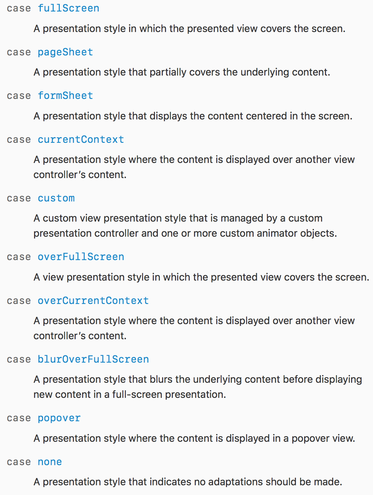

### 화면전환 - present


#### H.I.G에 나온 iOS의 화면전환 방식 (참고: 애플 [H.I.G](https://developer.apple.com/ios/human-interface-guidelines/overview/themes/))

* Present Modally 방식 : 밑에서 위로 올라오는 방식으로 구현되고, 팝업이나 다른 정보를 보여주고 싶을 때 반영하는 방식. 새롭게 페이지가 열리는 방식이 아니라 원래 정보는 아래 남아있고 그 위에 또 다른 화면이 뜨는 형태.

* UINavigation controller를 이용한 방식 : '설정'앱과 같이 계층적인 콘텐츠의 탐색에 용이하다(hierarchical organization of data).

* UITabbarController을 이용한 방식 : UITabBarController는 radio-style selection interface를 관리하는데 특화된 뷰 컨트롤러다. 탭바인터페이스는 화면의 bottom에 서로 다른 모드(또는 카테고리) 사이에 전환에 사용. 

#### 꼼꼼한 재은씨 기본편에 나오는 화면 전환

* iOS에서 화면을 전환하는 방법은 크게 두 가지
	1. 소스코드(프로그래밍적 화면전환 또는 동적인 화면 전환방식)
		- 특정 상황에 대응 가능, 조금 복잡하고 어렵다.
	2. 스토리보드(정적인 화면 전환방식)
		- 일괄적용 방식이라 특정 상황에 대응이 불가능, 구현이 쉽다.

* iOS에서의 화면 전환 개념
	* 1번 방식을 제외한 나머지 방식은 뷰 컨트롤러를 호출하는 방식.
		1. 뷰 컨트롤러의 뷰 위에 다른 뷰를 가져와 바꿔치기하기
		2. 뷰 컨트롤러에서 다른 뷰 컨트롤러를 호출하여 화면 전환하기
		3. 내비게이션 컨트롤러를 사용하여 화면 전환하기
		4. 화면 전환용 세그웨이 사용하여 화면 전환하기

### 1. 뷰 컨트롤러의 뷰 위에 다른 뷰를 가져와 바꿔치기하기
- 뷰를 사용
- 뷰 컨트롤러 안에 두 개의 루트 뷰를 준비한 다음, 상태에 따라 뷰를 교체해주기.
- MVC패턴을 거스르는 방법. 지양.

### 2. 뷰 컨트롤러에서 다른 뷰 컨트롤러를 호출하여 화면 전환하기
- `UIViewController`의 `present(_:animated:completion:)` 메소드로 호출
	- 새로운 뷰 컨트롤러로 기존 뷰 컨트롤러를 덮는다.
	- 새로운 뷰 컨트롤러(presentedViewController)와 호출한 뷰(presentingViewController).
	- 서로 참조할 수 있는 포인터가 생성됨. (서로 참조가 가능하다는 것을 기억!), (이전 뷰 컨트롤러의 상태 정보를 유지할 수 있다.)
	- 복귀 메소드 : `dismiss(animated:completion:)` -> dismiss 요청으로 생각하기
	- dismiss를 할 때 presentedViewController에서 self.dismiss를 하게 될 경우 자동으로 UIKit에 self.presenting.dismiss로 요청하기 때문에 새로 띄워진 뷰 컨트롤러에서는 `self.presenting.dismiss`나 `self.dismiss`나 상관없이 새로 띄운 뷰 컨트롤러가 내려간다.
	- **화면을 걷어내는 주체는 새로운 뷰 컨트롤러를 호출한 이전 뷰 컨트롤러**

```swift
@IBAction func nextButtonTouched(_ sender: Any) {
        guard let secondVC = self.storyboard?.instantiateViewController(withIdentifier: "SecondVC") else {
            return
        }
        self.present(secondVC, animated: true, completion: nil)
    }
```

```swift
// 새로운 띄운 뷰 컨트롤러에서
@IBAction func backButtonTouched(_ sender: Any) {
        self.dismiss(animated: true, completion: nil)
    }
```
	
	
### 3. 내비게이션 컨트롤러를 사용한 화면 전환하기
* 본 내용은 다른 문서에서 다룰 예정

### 4. 세그웨이를 이용한 화면 전환
* 본 내용은 다른 문서에서 다룰 예정


#### 프레젠테이션 스타일 (UIModalPresentationStyle)
> `present` 메서드를 사용할 경우 '뷰 컨트롤러를 어떻게 표시할지'에 대해서.



* 참고로 전환효과는 `UIModalTransitionStyle`에 정의되어 있다.
